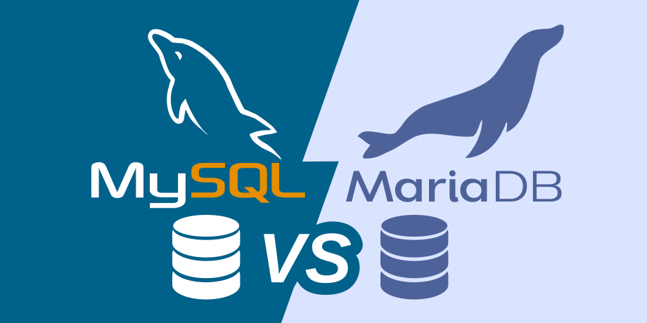

# PROJECTE 0.1 - Despliegue y Configuración en AWS
## Índice

1. [Despliegue en AWS](#1-despliegue-en-aws)
    - [Creación de Instancia EC2](#11-creación-de-instancia-ec2)
        - [Conexión mediante SSH](#111-conexión-mediante-ssh)
    - [Actualización del sistema](#12-actualización-del-sistema)
2. [Tecnologías utilizadas](#2-tecnologías-utilizadas)
    - [NGINX vs Apache](#21-nginx-vs-apache)
    - [PHP-FPM vs mod_php](#22-php-fpm-vs-mod_php)
    - [MariaDB vs MySQL](#23-mariadb-vs-mysql)
    - [Comparativa de Tecnologías](#24-comparativa-de-tecnologías)
3. [Instalación y Configuración](#3-instalación-y-configuración)
    - [Instalación de PHP](#31-instalación-de-php)
    - [Configuración de PHP](#32-configuración-de-php)
    - [Instalación de MariaDB](#33-instalación-de-mariadb)
    - [Configuración de MariaDB](#34-configuración-de-mariadb)
    - [Instalación de NGINX](#35-instalación-de-nginx)
    - [Configuración de NGINX](#36-configuración-de-nginx)
4. [Base de datos](#4-base-de-datos)
5. [Archivos del Proyecto](#5-archivos-del-proyecto)
6. [Permisos y Seguridad](#6-permisos-y-seguridad)
7. [Requisitos Funcionales](#7-requisitos-funcionales)
8. [Requisitos No Funcionales](#8-requisitos-no-funcionales)

## 1. Despliegue en AWS

### 1.1 Creación de Instancia EC2
- Lanzamiento del laboratorio de **AWS Academy**.  
- Abrir consola AWS y crear instancia EC2.  
- Selección de AMI: **Amazon Linux 2**.  
- Tipo de instancia: **t2.micro** (nivel gratuito).  
- Configuración de **grupo de seguridad**: puertos 22 (SSH), 80 (HTTP), 443 (HTTPS).  
- Generación de par de claves SSH.

#### 1.1.1. Conexión mediante SSH
    ssh -i "clave.pem" ec2-user@tu-ip-publica

### 1.2 Actualización del sistema
    sudo yum update -y

## 2. Tecnologías utilizadas
### 2.1. NGINX vs Apache

  

Se eligió **NGINX** como servidor web principal en lugar de **Apache** por varias razones:

- **Arquitectura basada en eventos:** NGINX maneja un gran número de conexiones concurrentes de manera más eficiente, mientras que Apache utiliza un modelo basado en procesos o hilos, que consume más memoria y CPU bajo carga alta.
- **Consumo de recursos:** NGINX es más ligero, lo que lo hace ideal para entornos cloud con recursos limitados (por ejemplo, **t2.micro** en AWS).
- **Rendimiento en contenido estático:** NGINX entrega archivos estáticos mucho más rápido que Apache, reduciendo tiempos de carga.
- **Estabilidad bajo carga:** Su diseño evita que el servidor se bloquee ante picos de tráfico, ofreciendo mayor confiabilidad para aplicaciones web modernas.

En resumen, **NGINX ofrece mayor eficiencia, estabilidad y escalabilidad** frente a Apache, especialmente en entornos con tráfico variable o alto número de conexiones simultáneas.

---

### 2.2. PHP-FPM vs mod_php

  

  

Se optó por **MariaDB** como sistema gestor de bases de datos en lugar de **MySQL** por varias razones:

- **Ligereza y rendimiento:** MariaDB es más ligera que MySQL, lo que se traduce en un mejor rendimiento en instancias con recursos limitados.
- **Compatibilidad completa:** Mantiene **compatibilidad total con SQL y con las APIs de MySQL**, permitiendo migraciones sencillas y sin necesidad de cambiar el código de la aplicación.
- **Desarrollo activo y comunidad:** Al ser un proyecto de código abierto con desarrollo activo, MariaDB recibe mejoras constantes en rendimiento, seguridad y estabilidad, mientras que algunas versiones de MySQL tienen ciclos de actualización más conservadores.
- **Funciones avanzadas:** MariaDB ofrece características adicionales como motores de almacenamiento optimizados, mejoras en replicación y mejor soporte para entornos modernos.

En resumen, **MariaDB combina compatibilidad, eficiencia y soporte activo**, siendo una alternativa moderna y confiable frente a MySQL.

### 2.4. Comparativa de Tecnologías

| Tecnología | Opción 1 | Opción 2 | Justificación de la elección |
|------------|----------|----------|------------------------------|
| Servidor web | **NGINX** | Apache | NGINX consume menos recursos, maneja mejor conexiones concurrentes, entrega contenido estático más rápido y es más estable bajo carga, ideal para entornos cloud. |
| Procesamiento PHP | **PHP-FPM** | mod_php | PHP-FPM separa la ejecución de PHP del servidor web, permite mejor control de procesos y memoria, mejora la estabilidad y es compatible con NGINX, mientras que mod_php es más pesado y limitado. |
| Base de datos | **MariaDB** | MySQL | MariaDB es más ligera, mantiene compatibilidad total con MySQL, tiene desarrollo activo, mejor rendimiento y funciones avanzadas, siendo ideal para entornos modernos y con recursos limitados. |

## 3. Instalación y configuración

### 3.1 Instalación de PHP
    sudo yum install -y httpd php

Comprobación del estado de los servicios para garantizar que PHP FPM está operativo.

### 3.2 Configuración de PHP
#### 3.2.1. Edición del archivo php.ini

Modificación del archivo de configuración principal de PHP para optimizar la subida de archivos multimedia.

    sudo nano /etc/php.ini

#### 3.2.2. Parámetros de configuración modificados

| Directiva             | Valor Original | Valor Configurado | Justificación Técnica                                                                 |
|-----------------------|----------------|-----------------|--------------------------------------------------------------------------------------|
| upload_tmp_dir        | 2M             | 10M             | Permite la subida de imágenes de mayor resolución (hasta 10MB), necesario para contenido multimedia moderno |
| upload_max_filesize   | 8M             | 50M             | Debe ser superior a upload_max_filesize para incluir el payload completo del formulario (archivo + metadatos) |
| max_file_upload       | 20             | 300             | Incrementa el timeout de ejecución a 300 segundos para evitar interrupciones en subidas lentas o procesamiento de imágenes |

### 3.3. Instalación de MariaDB

Instalación del stack completo LEMP (Linux, NGINX, MariaDB, PHP) mediante gestor de paquetes DNF.

    sudo dnf install -y nginx php-fpm php-mysqlnd mariadb105-server

### 3.4. Configuración de MariaDB

#### 3.4.1 Verificación del estado de los servicios

Comprobación del estado de los servicios para garantizar que todos los componentes están operativos.

    sudo systemctl status mariadb.service

#### 3.4.2 Hardening de seguridad

Ejecución del script de seguridad para establecer contraseña de root y eliminar configuraciones inseguras por defecto.

    sudo mysql_secure_installation

### 3.5 Instalación de NGINX

Instalación del servidor web NGINX mediante gestor de paquetes YUM.

    sudo yum install -y nginx

### 3.6 Configuración de NGINX
#### 3.6.1 Verificación de instalación con systemctl
    sudo systemctl status nginx

#### 3.6.2 Verificación de instalación con curl

    curl -I http://localhost

#### 3.6.3 Configuración del Virtual Host

Creación de archivo de configuración del sitio en /etc/nginx/conf.d/site.conf

    sudo nano /etc/nginx/conf.d/site.conf

Contenido del archivo:

    server {
        listen 80;
        server_name _;
        root /usr/share/nginx/html;
        index login.php;

        location / {
            try_files $uri $uri/ =404;
        }

        location ~ \.php$ {
            fastcgi_pass 127.0.0.1:9000;
            fastcgi_index index.php;
            fastcgi_param SCRIPT_FILENAME $document_root$fastcgi_script_name;
            include fastcgi_params;
        }
    }

#### 3.6.4 Verificación de PHP-FPM

Verificación y ajuste del pool por defecto en /etc/php-fpm.d/www.conf:

Antes de los cambios:

Después de los cambios:

Asegurar estas líneas:

    listen = 127.0.0.1:9000
    listen.owner = nginx
    listen.group = nginx
    user = nginx
    group = nginx

#### 3.6.5 Recarga de configuración

    sudo nginx -t
    sudo systemctl reload nginx

## 4. Base de Datos
### 4.1 Acceso a MariaDB

    sudo mysql -u root

### 4.2 Creación de Base de Datos y Tablas

    CREATE DATABASE extagram;
    USE extagram;

    CREATE TABLE usuarios (
        id INT AUTO_INCREMENT PRIMARY KEY,
        username VARCHAR(50) UNIQUE NOT NULL,
        password VARCHAR(255) NOT NULL,
        created_at TIMESTAMP DEFAULT CURRENT_TIMESTAMP
    );

    CREATE TABLE posts (
        id INT AUTO_INCREMENT PRIMARY KEY,
        user_id INT NOT NULL,
        message TEXT NOT NULL,
        image_path VARCHAR(255),
        created_at TIMESTAMP DEFAULT CURRENT_TIMESTAMP,
        FOREIGN KEY (user_id) REFERENCES usuarios(id) ON DELETE CASCADE
    );

    INSERT INTO usuarios (username, password) 
    VALUES ('admin', '$2y$10$92IXUNpkjO0rOQ5byMi.Ye4oKoEa3Ro9llC/.og/at2.uheWG/igi');
    -- Contraseña: 123456

### 4.3 Verificación

    SHOW DATABASES;

## 5. Archivos del Proyecto
Todos los archivos se crean en /usr/share/nginx/html/
### 5.1 Creación de extagram.php
Creación del archivo principal de la aplicación web.

    sudo nano /usr/share/nginx/html/extagram.php

Código del archivo extagram.php:

    <?php
    session_start();
    if (!isset($_SESSION['user_id'])) {
        header("Location: login.php");
        exit;
    }
    ?>
    <!DOCTYPE html>
    <html lang="es">
    <head>
        <meta charset="UTF-8">
        <meta name="viewport" content="width=device-width, initial-scale=1.0">
        <link rel="stylesheet" href="https://static.extagram.itb">
        <title>Extagram 2026</title>
        <link rel="stylesheet" href="style.css">
        <link rel="stylesheet" href="https://cdnjs.cloudflare.com/ajax/libs/font-awesome/6.4.0/css/all.min.css">
    </head>
    <body>
        

            <header class="header">
                

                    <i class="fas fa-camera"></i>
                    Extagram
                

            

                👤 <?php echo htmlspecialchars($_SESSION['username'] ?? 'Usuario'); ?>
                <a href="logout.php" class="logout-btn">Cerrar sesión</a>
            

            </header>

            <main class="main-content">
                

                    <form method="POST" enctype="multipart/form-data" action="upload.php" class="post-form">
                        

                            <input type="text" name="post" placeholder="Write something..." required>
                        

                        
                        

                            <input id="file" type="file" name="photo" accept="image/*" onchange="document.getElementById('preview').src=window.URL.createObjectURL(this.files[0])" hidden>
                            <label for="file" class="upload-label">
                                <i class="fas fa-image"></i> Seleccionar imagen
                            </label>
                        

                        
                        

                            
                        

                        
                        <button type="submit" class="publish-btn">
                            <i class="fas fa-paper-plane"></i> Publish
                        </button>
                    </form>
                

                

                    <?php
                    mysqli_report(MYSQLI_REPORT_ERROR | MYSQLI_REPORT_STRICT);
                    try {
                        $db = new mysqli("localhost", "extagram_admin", "pass123", "extagram_db");
                        $result = $db->query("SELECT * FROM posts"); 
                        
                        while ($fila = $result->fetch_assoc()) {
                            echo "
";
                            
                            // ✅ Botón de eliminación con datos directos (sin urlencode)
                            echo "<button class='delete-btn' 
                                data-post='" .     <?php
    // Habilitar visualización de errores y reporte completo
    ini_set('display_errors', 'On');
    error_reporting(E_ALL);

    echo "DEBUG: Script upload.php iniciado. "; // DEBUG 1

    // Configuración de errores para MySQLi
    mysqli_report(MYSQLI_REPORT_ERROR | MYSQLI_REPORT_STRICT);

    // Definir la ruta de la carpeta de subidas
    $upload_dir = '/usr/share/nginx/html/uploads/';

    if ($_SERVER['REQUEST_METHOD'] === 'POST' && !empty($_POST["post"])) {
        
        echo "DEBUG: Entrando al bloque POST. "; // DEBUG 2

        $photoid = null;

        if (isset($_FILES['photo']) && $_FILES['photo']['error'] === UPLOAD_ERR_OK) {
            echo "DEBUG: Archivo de foto detectado sin errores. "; // DEBUG 3
            $extension = pathinfo($_FILES['photo']['name'], PATHINFO_EXTENSION);
            $photoid = uniqid('extagram_') . "." . $extension;
            $target_path = $upload_dir . $photoid;

            if (!move_uploaded_file($_FILES['photo']['tmp_name'], $target_path)) {
                $error_info = error_get_last();
                die("Error crítico al mover el archivo. Detalles: " . print_r($error_info, true));
            }
            echo "DEBUG: Archivo movido con éxito a $target_path. "; // DEBUG 4
        } else {
            echo "DEBUG: No hay foto o hubo un error de subida. ";
            if (isset($_FILES['photo'])) {
                echo "DEBUG: Error code: " . $_FILES['photo']['error'] . " ";
            }
        }

        try {
            echo "DEBUG: Intentando conectar a la BD. "; // DEBUG 5
            $db = new mysqli("localhost", "extagram_admin", "pass123", "extagram_db");
            
            $stmt = $db->prepare("INSERT INTO posts (post, photourl) VALUES (?, ?)");
            $stmt->bind_param("ss", $_POST["post"], $photoid);
            $stmt->execute();
            $stmt->close();
            $db->close();
            echo "DEBUG: Datos guardados en BD con éxito. "; // DEBUG 6

        } catch (Exception $e) {
            die("Error al guardar en BD: " . $e->getMessage());
        }
    }

    // Redirigir solo si todo el script se completó sin 'die()'
    header("Location: extagram.php");
    exit;
    ?>htmlspecialchars($fila['post'], ENT_QUOTES) . "' 
                                data-photourl='" . htmlspecialchars($fila['photourl'], ENT_QUOTES) . "'
                                onclick='deletePost(this)'>&times;</button>";
                            
                            echo "
";
                            echo "
" . htmlspecialchars($fila['post']) . "
";
                            if (!empty($fila['photourl'])) {
                                echo "
";
                                echo "";
                                echo "
";
                            }
                            echo "
";
                            echo "
";
                            echo "<i class='far fa-heart'></i> 0";
                            echo "<i class='far fa-comment'></i> 0";
                            echo "
";
                            echo "
";
                        }
                        $db->close();
                    } catch (Exception $e) {
                        echo "
";
                        echo "<i class='fas fa-exclamation-triangle'></i>";
                        echo "
Error de conexión: " . htmlspecialchars($e->getMessage()) . "
";
                        echo "
";
                    }
                    ?>
                

            </main>

            <footer class="footer">
                
&copy; 2026 Extagram - Todos los derechos reservados

            </footer>
        

        
    </body>
    </html>

### 5.2 Creación de upload.ph

Creación del endpoint API para la subida de archivos.

    sudo nano /usr/share/nginx/html/upload.php

Código del archivo upload.php:

    <?php
    // Habilitar visualización de errores y reporte completo
    ini_set('display_errors', 'On');
    error_reporting(E_ALL);

    echo "DEBUG: Script upload.php iniciado. "; // DEBUG 1

    // Configuración de errores para MySQLi
    mysqli_report(MYSQLI_REPORT_ERROR | MYSQLI_REPORT_STRICT);

    // Definir la ruta de la carpeta de subidas
    $upload_dir = '/usr/share/nginx/html/uploads/';

    if ($_SERVER['REQUEST_METHOD'] === 'POST' && !empty($_POST["post"])) {
        
        echo "DEBUG: Entrando al bloque POST. "; // DEBUG 2

        $photoid = null;

        if (isset($_FILES['photo']) && $_FILES['photo']['error'] === UPLOAD_ERR_OK) {
            echo "DEBUG: Archivo de foto detectado sin errores. "; // DEBUG 3
            $extension = pathinfo($_FILES['photo']['name'], PATHINFO_EXTENSION);
            $photoid = uniqid('extagram_') . "." . $extension;
            $target_path = $upload_dir . $photoid;

            if (!move_uploaded_file($_FILES['photo']['tmp_name'], $target_path)) {
                $error_info = error_get_last();
                die("Error crítico al mover el archivo. Detalles: " . print_r($error_info, true));
            }
            echo "DEBUG: Archivo movido con éxito a $target_path. "; // DEBUG 4
        } else {
            echo "DEBUG: No hay foto o hubo un error de subida. ";
            if (isset($_FILES['photo'])) {
                echo "DEBUG: Error code: " . $_FILES['photo']['error'] . " ";
            }
        }

        try {
            echo "DEBUG: Intentando conectar a la BD. "; // DEBUG 5
            $db = new mysqli("localhost", "extagram_admin", "pass123", "extagram_db");
            
            $stmt = $db->prepare("INSERT INTO posts (post, photourl) VALUES (?, ?)");
            $stmt->bind_param("ss", $_POST["post"], $photoid);
            $stmt->execute();
            $stmt->close();
            $db->close();
            echo "DEBUG: Datos guardados en BD con éxito. "; // DEBUG 6

        } catch (Exception $e) {
            die("Error al guardar en BD: " . $e->getMessage());
        }
    }

    // Redirigir solo si todo el script se completó sin 'die()'
    header("Location: extagram.php");
    exit;
    ?>

### 5.3 Creación de style.css
Creación de la hoja de estilos para la interfaz de usuario.

    sudo nano /usr/share/nginx/html/style.css

Código del archivo style.css:

    * {
        margin: 0;
        padding: 0;
        box-sizing: border-box;
    }

    :root {
        --primary: #405DE6;
        --secondary: #5851DB;
        --accent: #833AB4;
        --bg: #fafafa;
        --card: #fff;
        --border: #dbdbdb;
        --text: #262626;
    }

    body {
        background: var(--bg);
        font-family: -apple-system, BlinkMacSystemFont, 'Segoe UI', Roboto, sans-serif;
        color: var(--text);
        line-height: 1.5;
        padding: 20px;
    }

    .container {
        max-width: 900px;
        margin: 0 auto;
    }

    .header {
        background: linear-gradient(135deg, var(--primary), var(--secondary), var(--accent));
        color: white;
        padding: 16px 20px;
        border-radius: 12px;
        margin-bottom: 30px;
        box-shadow: 0 4px 12px rgba(0,0,0,0.1);
        text-align: center;
    }

    .logo {
        display: flex;
        align-items: center;
        justify-content: center;
        gap: 12px;
        font-size: 28px;
        font-weight: bold;
    }

    .logo i {
        font-size: 32px;
    }

    .main-content {
        display: grid;
        gap: 30px;
    }

    .create-post {
        background: var(--card);
        border-radius: 16px;
        padding: 25px;
        box-shadow: 0 4px 16px rgba(0,0,0,0.08);
    }

    .input-group input {
        width: 100%;
        padding: 14px;
        border: 2px solid var(--border);
        border-radius: 12px;
        font-size: 16px;
        transition: border-color 0.3s;
    }

    .input-group input:focus {
        outline: none;
        border-color: var(--primary);
    }

    .image-upload {
        margin: 15px 0;
    }

    .upload-label {
        display: flex;
        align-items: center;
        justify-content: center;
        gap: 10px;
        padding: 14px;
        background: #f8f9fa;
        border: 2px dashed var(--border);
        border-radius: 12px;
        cursor: pointer;
        transition: all 0.3s;
        font-weight: 500;
        color: var(--primary);
    }

    .upload-label:hover {
        background: #edf2ff;
        border-color: var(--primary);
    }

    .preview-container {
        margin: 20px 0;
        display: flex;
        justify-content: center;
    }

    #preview {
        max-width: 100%;
        max-height: 400px;
        border-radius: 12px;
        box-shadow: 0 4px 12px rgba(0,0,0,0.1);
        display: block;
    }

    .publish-btn {
        background: linear-gradient(135deg, var(--primary), var(--secondary));
        color: white;
        border: none;
        width: 100%;
        padding: 14px;
        border-radius: 12px;
        font-size: 16px;
        font-weight: 600;
        cursor: pointer;
        transition: transform 0.2s, box-shadow 0.2s;
        display: flex;
        align-items: center;
        justify-content: center;
        gap: 10px;
    }

    .publish-btn:hover {
        transform: translateY(-2px);
        box-shadow: 0 6px 15px rgba(64, 93, 230, 0.4);
    }

    .publish-btn:active {
        transform: translateY(0);
    }

    .posts-container {
        display: flex;
        flex-direction: column;
        gap: 25px;
    }

    .post {
        background: var(--card);
        border-radius: 16px;
        overflow: hidden;
        box-shadow: 0 4px 12px rgba(0,0,0,0.08);
        transition: transform 0.3s;
        position: relative;
        padding: 0;
    }

    .post:hover {
        transform: translateY(-5px);
    }

    .post-content {
        padding: 20px;
    }

    .post-content p {
        font-size: 18px;
        line-height: 1.6;
        margin-bottom: 15px;
    }

    .post-image {
        width: 100%;
        overflow: hidden;
    }

    .post-image img {
        width: 100%;
        height: auto;
        display: block;
        transition: transform 0.5s;
    }

    .post-image:hover img {
        transform: scale(1.03);
    }

    .post-footer {
        padding: 15px 20px;
        border-top: 1px solid var(--border);
        display: flex;
        gap: 25px;
        color: #8e8e8e;
    }

    .post-footer span {
        display: flex;
        align-items: center;
        gap: 6px;
        cursor: pointer;
        transition: color 0.3s;
    }

    .post-footer span:hover {
        color: var(--text);
    }

    /* Botón de eliminación */
    .delete-btn {
        position: absolute;
        top: 10px;
        right: 10px;
        background: #ff4444;
        color: white;
        border: none;
        border-radius: 50%;
        width: 28px;
        height: 28px;
        cursor: pointer;
        font-size: 18px;
        display: flex;
        align-items: center;
        justify-content: center;
        opacity: 0;
        transition: opacity 0.2s;
        z-index: 10;
        box-shadow: 0 2px 8px rgba(0,0,0,0.2);
    }

    .post:hover .delete-btn {
        opacity: 1;
    }

    .delete-btn:hover {
        background: #ff0000;
        transform: scale(1.1);
    }

    .error-message {
        background: #fff8f8;
        border-left: 4px solid #dc3545;
        padding: 15px;
        border-radius: 0 8px 8px 0;
        margin: 20px 0;
        color: #dc3545;
    }

    .error-message i {
        margin-right: 10px;
    }

    .footer {
        text-align: center;
        color: #8e8e8e;
        padding: 30px 0 10px;
        margin-top: 20px;
        border-top: 1px solid var(--border);
        font-size: 14px;
    }

    @media (max-width: 600px) {
        .container {
            padding: 10px;
        }
        
        .header {
            border-radius: 10px;
            padding: 12px;
        }
        
        .logo {
            font-size: 24px;
        }
        
        .logo i {
            font-size: 26px;
        }
        
        .create-post, .post {
            border-radius: 12px;
        }
        
        .input-group input {
            padding: 12px;
        }
        
        .publish-btn {
            padding: 12px;
            font-size: 15px;
        }
        
        .delete-btn {
            width: 24px;
            height: 24px;
            font-size: 16px;
        }
    }

    /* Estilos para login/logout */
    .header {
        display: flex;
        justify-content: space-between;
        align-items: center;
        padding: 15px 25px;
    }

    .user-info {
        display: flex;
        align-items: center;
        gap: 20px;
        color: white;
        font-weight: 500;
    }

    .logout-btn {
        color: white;
        text-decoration: none;
        background: rgba(255,255,255,0.2);
        padding: 8px 16px;
        border-radius: 20px;
        transition: background 0.3s;
    }

    .logout-btn:hover {
        background: rgba(255,255,255,0.3);
    }

### 5.4 Creación de preview.svg
Creación de archivo SVG de preview (opcional, para favicon o preview).

    sudo nano /usr/share/nginx/html/preview.svg
Código del archivo preview.svg:

    <?xml version="1.0" encoding="UTF-8"?>
    <svg version="1.1" xmlns="http://www.w3.org/2000/svg" viewBox="0 0 100 100" width="300" height="300">
    <g>
    <rect width="100" height="100" fill="#cecece"/>
    <path fill="#ffffff" transform="translate(25 25)" d="M48.1,26.3c0,4.3,0,7.2-0.1,8.8c-0.2,3.9-1.3,6.9-3.5,9s-5.1,3.3-9,3.5c-1.6,0.1-4.6,0.1-8.8,0.1c-4.3,0-7.2,0-8.8-0.1   c-3.9-0.2-6.9-1.3-9-3.5c-2.1-2.1-3.3-5.1-3.5-9c-0.1-1.6-0.1-4.6-0.1-8.8s0-7.2,0.1-8.8c0.2-3.9,1.3-6.9,3.5-9   c2.1-2.1,5.1-3.3,9-3.5c1.6-0.1,4.6-0.1,8.8-0.1c4.3,0,7.2,0,8.8,0.1c3.9,0.2,6.9,1.3,9,3.5s3.3,5.1,3.5,9   C48,19.1,48.1,22,48.1,26.3z M28.8,8.7c-1.3,0-2,0-2.1,0c-0.1,0-0.8,0-2.1,0c-1.3,0-2.3,0-2.9,0c-0.7,0-1.6,0-2.7,0.1   c-1.1,0-2.1,0.1-2.9,0.3c-0.8,0.1-1.5,0.3-2,0.5c-0.9,0.4-1.7,0.9-2.5,1.6c-0.7,0.7-1.2,1.5-1.6,2.5c-0.2,0.5-0.4,1.2-0.5,2   s-0.2,1.7-0.3,2.9c0,1.1-0.1,2-0.1,2.7c0,0.7,0,1.7,0,2.9c0,1.3,0,2,0,2.1s0,0.8,0,2.1c0,1.3,0,2.3,0,2.9c0,0.7,0,1.6,0.1,2.7   c0,1.1,0.1,2.1,0.3,2.9s0.3,1.5,0.5,2c0.4,0.9,0.9,1.7,1.6,2.5c0.7,0.7,1.5,1.2,2.5,1.6c0.5,0.2,1.2,0.4,2,0.5   c0.8,0.1,1.7,0.2,2.9,0.3s2,0.1,2.7,0.1c0.7,0,1.7,0,2.9,0c1.3,0,2,0,2.1,0c0.1,0,0.8,0,2.1,0c1.3,0,2.3,0,2.9,0   c0.7,0,1.6,0,2.7-0.1c1.1,0,2.1-0.1,2.9-0.3c0.8-0.1,1.5-0.3,2-0.5c0.9-0.4,1.7-0.9,2.5-1.6c0.7-0.7,1.2-1.5,1.6-2.5   c0.2-0.5,0.4-1.2,0.5-2c0.1-0.8,0.2-1.7,0.3-2.9c0-1.1,0.1-2,0.1-2.7c0-0.7,0-1.7,0-2.9c0-1.3,0-2,0-2.1s0-0.8,0-2.1   c0-1.3,0-2.3,0-2.9c0-0.7,0-1.6-0.1-2.7c0-1.1-0.1-2.1-0.3-2.9c-0.1-0.8-0.3-1.5-0.5-2c-0.4-0.9-0.9-1.7-1.6-2.5   c-0.7-0.7-1.5-1.2-2.5-1.6c-0.5-0.2-1.2-0.4-2-0.5c-0.8-0.1-1.7-0.2-2.9-0.3c-1.1,0-2-0.1-2.7-0.1C31.1,8.7,30.1,8.7,28.8,8.7z  M34.4,18.5c2.1,2.1,3.2,4.7,3.2,7.8s-1.1,5.6-3.2,7.8c-2.1,2.1-4.7,3.2-7.8,3.2c-3.1,0-5.6-1.1-7.8-3.2c-2.1-2.1-3.2-4.7-3.2-7.8   s1.1-5.6,3.2-7.8c2.1-2.1,4.7-3.2,7.8-3.2C29.7,15.3,32.3,16.3,34.4,18.5z M31.7,31.3c1.4-1.4,2.1-3.1,2.1-5s-0.7-3.7-2.1-5.1   c-1.4-1.4-3.1-2.1-5.1-2.1c-2,0-3.7,0.7-5.1,2.1s-2.1,3.1-2.1,5.1s0.7,3.7,2.1,5c1.4,1.4,3.1,2.1,5.1,2.1   C28.6,33.4,30.3,32.7,31.7,31.3z M39.9,13c0.5,0.5,0.8,1.1,0.8,1.8c0,0.7-0.3,1.3-0.8,1.8c-0.5,0.5-1.1,0.8-1.8,0.8   s-1.3-0.3-1.8-0.8c-0.5-0.5-0.8-1.1-0.8-1.8c0-0.7,0.3-1.3,0.8-1.8c0.5-0.5,1.1-0.8,1.8-0.8S39.4,12.5,39.9,13z"/>
    </g>
    </svg>

### 5.5 Creación de carpeta uploads/
Creación del directorio para almacenar las imágenes subidas por los usuarios.

    sudo mkdir -p /usr/share/nginx/html/uploads

### 5.6 Creación de login.php
Creación del sistema de autenticación con gestión de sesiones.

    sudo nano /usr/share/nginx/html/login.php

Código del archivo login.php:

    <?php
    session_start();

    if (isset($_SESSION['user_id'])) {
        header("Location: extagram.php");
        exit;
    }

    $error = '';

    if ($_SERVER['REQUEST_METHOD'] === 'POST') {
        $username = trim($_POST['username'] ?? '');
        $password = $_POST['password'] ?? '';

        if (empty($username) || empty($password)) {
            $error = "Usuario y contraseña son obligatorios";
        } else {
            mysqli_report(MYSQLI_REPORT_ERROR | MYSQLI_REPORT_STRICT);
            try {
                $db = new mysqli("localhost", "extagram_admin", "pass123", "extagram_db");
                $stmt = $db->prepare("SELECT id, password_hash FROM users WHERE username = ?");
                $stmt->bind_param("s", $username);
                $stmt->execute();
                $result = $stmt->get_result();

                if ($result->num_rows === 1) {
                    $user = $result->fetch_assoc();
                    if (password_verify($password, $user['password_hash'])) {
                        $_SESSION['user_id'] = $user['id'];
                        $_SESSION['username'] = $username;
                        header("Location: extagram.php");
                        exit;
                    }
                }
                $error = "Usuario o contraseña incorrectos";
                $stmt->close();
                $db->close();
            } catch (Exception $e) {
                $error = "Error: " . $e->getMessage();
            }
        }
    }
    ?>

    <!DOCTYPE html>
    <html lang="es">
    <head>
        <meta charset="UTF-8">
        <meta name="viewport" content="width=device-width, initial-scale=1.0">
        <title>Login - Extagram</title>
        
        <link rel="stylesheet" href="https://cdnjs.cloudflare.com/ajax/libs/font-awesome/6.4.0/css/all.min.css">
    </head>
    <body>
        

            

                <i class="fas fa-camera"></i>
                Extagram
            

            
            <?php if ($error): ?>
                
<?php echo htmlspecialchars($error); ?>

            <?php endif; ?>
            
            <form method="POST">
                

                    <label for="username">Usuario</label>
                    <input type="text" id="username" name="username" required autofocus>
                

                
                

                    <label for="password">Contraseña</label>
                    <input type="password" id="password" name="password" required>
                

                
                <button type="submit" class="btn">
                    <i class="fas fa-sign-in-alt"></i> Iniciar Sesión
                </button>
            </form>
        

    </body>
    </html>

### 5.7 Creación de logout.php
Creación del script para cerrar sesión y destruir variables de sesión.

    sudo nano /usr/share/nginx/html/logout.php

Código del archivo logout.php:

    <?php
    session_start();
    session_destroy();
    header("Location: login.php");
    exit;
    ?>

### 5.8 Gestión de Sesiones PHP
Configuración de permisos para el directorio de sesiones PHP:

    sudo chown -R nginx:nginx /usr/share/nginx/html/
    sudo chmod -R 755 /usr/share/nginx/html/

### 5.9 Reinicio de Servicios
Reinicio de los servicios PHP-FPM y NGINX para aplicar todos los cambios:

    sudo systemctl restart php-fpm
    sudo systemctl restart nginx

### 5.10 Creación de Tabla de Usuarios en MariaDB
Acceso a MariaDB y creación de la tabla de usuarios con un usuario de prueba:
    sudo mysql -u root

    USE extagram;

    CREATE TABLE usuarios (
        id INT AUTO_INCREMENT PRIMARY KEY,
        username VARCHAR(50) UNIQUE NOT NULL,
        password VARCHAR(255) NOT NULL,
        created_at TIMESTAMP DEFAULT CURRENT_TIMESTAMP
    );

    INSERT INTO usuarios (username, password) 
    VALUES ('admin', '$2y$10$92IXUNpkjO0rOQ5byMi.Ye4oKoEa3Ro9llC/.og/at2.uheWG/igi');
    -- Contraseña: 123456

### 5.11 Verificación de Subida de Archivos
Prueba de escritura en el directorio uploads para verificar permisos:

    sudo -u nginx sh -c 'touch /usr/share/nginx/html/uploads/test.txt && rm /usr/share/nginx/html/uploads/test.txt' && echo "✅ Permisos correctos" || echo "❌ Error en permisos"

## 6. Gestión de Permisos
Configuración de Permisos del Sistema de Archivos

    # Propietario y grupo del directorio web
    sudo chown -R nginx:nginx /usr/share/nginx/html/

    # Permisos generales (lectura/ejecución para todos, escritura para propietario)
    sudo chmod -R 755 /usr/share/nginx/html/

    # Permisos especiales para el directorio de subidas (escritura para grupo)
    sudo chmod 775 /usr/share/nginx/html/uploads

Verificación:
    ls -la /usr/share/nginx/html/

## 7. Docker 

## . Requisitos Funcionales
✅ Implementados:
1. Entrar a la página y que se vea correctamente.
2. Escribir un mensaje y enviarlo.
3. Subir una foto junto al mensaje (o publicar solo texto).
4. Que lo que envías se guarde y no se pierda al recargar.
5. Ver una lista con las publicaciones que ya se han hecho.
6. Que en cada publicación se vea el texto y, si hay foto, también la foto.
7. Que los botones y la web respondan bien (que no se quede bloqueado al darle a publicar).
8. Si algo sale mal, que la web lo indique de alguna manera.

Credenciales de prueba:
Usuario: admin
Contraseña: password
Acceder a: http://<IP-PÚBLICA>/extagram.php

## . Requisitos No Funcionales
✅ Cumplidos:
1. Que no se caiga fácilmente y, si algo falla, se recupere rápido.
2. Que cargue a una velocidad razonable.
3. Que, con varias personas entrando a la vez, siga funcionando bien.
4. Que las fotos se guarden en un sitio preparado para eso y con permisos correctos.
5. Que sea fácil de volver a montar en otro servidor siguiendo los pasos.
6. Que quede claro qué se ha cambiado y cuándo.
7. Que sea fácil encontrar errores si pasa algo.

