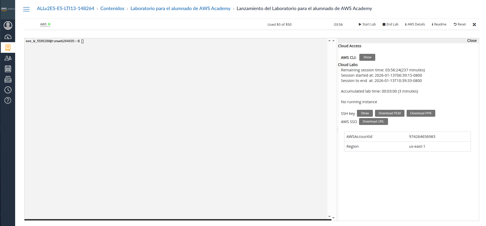
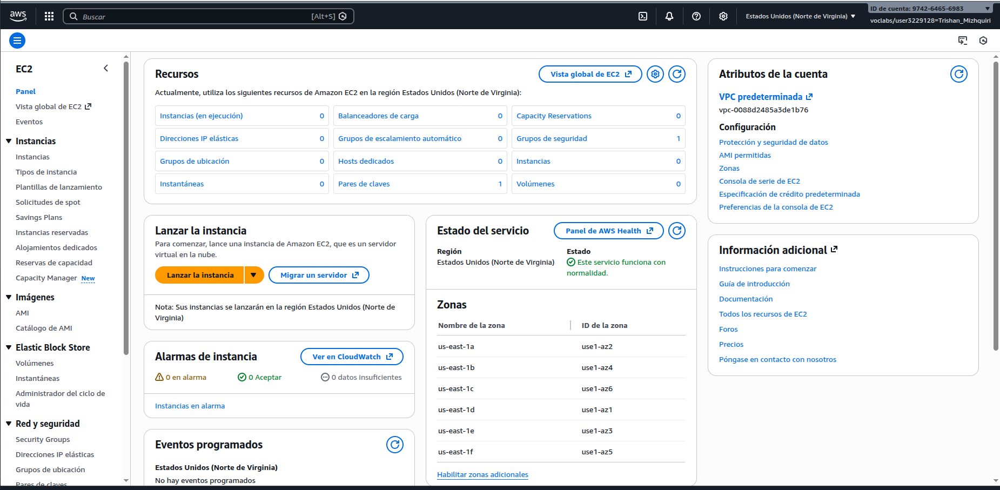

# PROJECTE 0.1 - Desplegament extagram

## Lanzamiento de la máquina AWS
- Lanzamiento del Laboratorio para el alumnado de AWS Academy

- Abro la consola AWS para cerar instancia

- Termino creando la instancia

- Ya la ejecuto y los datos

- Conexion exitosa

## Conexión de la máquina AWS con ssh

