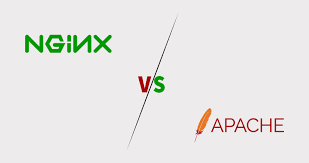

# 01. Manual de Desplegament Natiu (Sprint 1)

## Índice

1. [Desplegament en AWS](#1-desplegament-en-aws)
    - [Creació d'Instància EC2](#11-creació-dinstància-ec2)
        - [Connexió mitjançant SSH](#111-connexió-mitjançant-ssh)
    - [Actualització del sistema](#12-actualització-del-sistema)
2. [Tecnologies utilitzades](#2-tecnologies-utilitzades)
    - [NGINX vs Apache](#21-nginx-vs-apache)
    - [PHP-FPM vs mod_php](#22-php-fpm-vs-mod_php)
    - [MariaDB vs MySQL](#23-mariadb-vs-mysql)
    - [Comparativa de Tecnologies](#24-comparativa-de-tecnologies)
3. [Instal·lació i Configuració](#3-instal·lació-i-configuració)
    - [Instal·lació de PHP](#31-instal·lació-de-php)
    - [Configuració de PHP](#32-configuració-de-php)
    - [Instal·lació de MariaDB](#33-instal·lació-de-mariadb)
    - [Configuració de MariaDB](#34-configuració-de-mariadb)
    - [Instal·lació de NGINX](#35-instal·lació-de-nginx)
    - [Configuració de NGINX](#36-configuració-de-nginx)
4. [Base de dades](#4-base-de-dades)
5. [Arxius del Projecte](#5-arxius-del-projecte)
6. [Permisos i Seguretat](#6-permisos-i-seguretat)
7. [Validació del Sistema](#7-validació-del-sistema)
    - [Requisits Funcionals](#71-requisits-funcionals)
    - [Requisits No Funcionals](#72-requisits-no-funcionals)
8. [Credencials de Prova](#8-credencials-de-prova)


## 1. Deplegament en AWS

### 1.1 Creació d'Instància EC2
- Llançament del laboratori d'**AWS Academy**.  
- Obrir consola AWS i crear instància EC2.  
- Selecció d'AMI: **Amazon Linux 2**.  
- Tipus d'instància: **t2.micro**(nivell gratuït).
- Configuració de **grup de seguretat:** ports 22 (SSH), 80 (HTTP), 443 (HTTPS).
- Generació de parell de claus SSH.


#### 1.1.1. Connexió mitjançant SSH
```bash
ssh -i "clave.pem" ec2-user@tu-ip-publica
```


### 1.2 Actualització del sistema
Per garantir la seguretat i estabilitat, s'executa l'actualització de tots els paquets del sistema operatiu:

```bash
sudo yum update -y
```


## 2. Tecnologies utilitzades

### 2.1. NGINX vs Apache

<p align="center">
  
</p>

Es va triar **NGINX** com a servidor web principal en lloc d'**Apache** per diverses raons:

- **Arquitectura basada en esdeveniments:** NGINX gestiona un gran nombre de connexions concurrents de manera més eficient, mentre que Apache utilitza un model basat en processos o fils, que consumeix més memòria i CPU sota càrrega alta.
- **Consum de recursos:** NGINX és més lleuger, la qual cosa el fa ideal per a entorns cloud amb recursos limitats (per exemple, l'instància **t2.micro** a AWS).
- **Rendiment en contingut estàtic:** NGINX lliura arxius estàtics molt més ràpid que Apache, reduint els temps de càrrega.
- **Estabilitat sota càrrega:** El seu disseny evita que el servidor es bloquegi davant pics de trànsit, oferint major fiabilitat per a aplicacions web modernes.

En resum, **NGINX ofereix major eficiència, estabilitat i escalabilitat** enfront d'Apache, especialment en entorns amb trànsit variable o un alt nombre de connexions simultànies.

---

### 2.2. PHP-FPM vs mod_php

<p align="center">
  
</p>

Es va triar **PHP-FPM (FastCGI Process Manager)** en lloc de **mod_php** per diverses raons clau:

- **Separació de responsabilitats:** PHP-FPM executa els scripts PHP de forma independent del servidor web, mentre que mod_php executa PHP dins del mateix procés d'Apache. Això significa que si un script falla, **NGINX continua funcionant sense interrupcions**, garantint una major estabilitat.
- **Eficiència i rendiment:** PHP-FPM permet gestionar múltiples processos PHP de manera optimitzada i controlada, ajustant memòria, nombre de processos i temps d'execució. Això resulta més eficient que mod_php, que consumeix més memòria i recursos en córrer PHP dins del servidor web.
- **Compatibilitat amb NGINX:** NGINX no suporta mòduls PHP com Apache, per la qual cosa PHP-FPM és l'opció natural i recomanada per a aquesta combinació.
- **Escalabilitat i seguretat:** En separar l'execució de PHP del servidor web, es facilita l'aïllament de processos, la gestió d'usuaris i la implementació d'entorns escalables o contenidors, millorant tant la seguretat com la capacitat d'escalar l'aplicació.

En resum, **PHP-FPM ofereix estabilitat, rendiment i compatibilitat amb NGINX**, mentre que mod_php seria més limitat i pesat, especialment en entorns cloud amb recursos limitats.

---

### 2.3. MariaDB vs MySQL

<p align="center">
  
</p>

Es va optar per **MariaDB** com a sistema gestor de bases de dades en lloc de **MySQL** per diverses raons:

- **Lleugeresa i rendiment:** MariaDB és més lleugera que MySQL, la qual cosa es tradueix en un millor rendiment en instàncies amb recursos limitats.
- **Compatibilitat completa:** Manté **compatibilitat total amb SQL i amb les APIs de MySQL**, permetent migracions senzilles i sense necessitat de canviar el codi de l'aplicació.
- **Desenvolupament actiu i comunitat:** En ser un projecte de codi obert amb desenvolupament actiu, MariaDB rep millores constants en rendiment, seguretat i estabilitat, mentre que algunes versions de MySQL tenen cicles d'actualització més conservadors.
- **Funcions avançades:** MariaDB ofereix característiques addicionals com motors d'emmagatzematge optimitzats, millores en replicació i millor suport per a entorns moderns.

En resum, **MariaDB combina compatibilitat, eficiència i suport actiu**, sent una alternativa moderna i confiable enfront de MySQL.

---

### 2.4. Comparativa de Tecnologies

| Tecnologia | Opció 1 | Opció 2 | Justificació de l'elecció |
|:---|:---|:---|:---|
| **Servidor web** | **NGINX** | Apache | NGINX consumeix menys recursos, gestiona millor les connexions concurrents i és més estable sota càrrega. |
| **Processament PHP** | **PHP-FPM** | mod_php | Separa l'execució del servidor web, permet millor control de memòria i és compatible amb NGINX. |
| **Base de dades** | **MariaDB** | MySQL | Més lleugera, compatible amb MySQL i ideal per a entorns cloud amb recursos limitats. |


## 3. Instal·lació i configuració

### 3.1 Instal·lació de PHP
```bash
sudo yum install -y httpd php
```


Comprovació de l'estat dels serveis per garantir que PHP-FPM està operatiu.


### 3.2 Configuració de PHP
#### 3.2.1. Edició de l'arxiu php.ini
Modificació de l'arxiu de configuració principal de PHP per optimitzar la pujada d'arxius multimèdia.
```bash
sudo nano /etc/php.ini
```


#### 3.2.2. Paràmetres de configuració modificats

| Directiva             | Valor Original | Valor Configurat | Justificació Tècnica                                                                    |
|-----------------------|----------------|-----------------|--------------------------------------------------------------------------------------|
| upload_tmp_dir        | 2M             | 10M             | Permet la pujada d'imatges de major resolució (fins a 10MB), necessari per a contingut multimèdia modern. |
| upload_max_filesize   | 8M             | 50M             | Ha de ser superior a `upload_max_filesize` per incloure el payload complet del formulari (arxiu + metadades). |
| max_file_upload       | 20             | 300             | Incrementa el timeout d'execució a 300 segons per evitar interrupcions en pujades lentes o processament d'imatges. |


### 3.3. Instal·lació de MariaDB

Instal·lació de l'stack complet LEMP (Linux, NGINX, MariaDB, PHP) mitjançant el gestor de paquets DNF.

```bash
sudo dnf install -y nginx php-fpm php-mysqlnd mariadb105-server
```


### 3.4. Configuració de MariaDB

#### 3.4.1 Verificació de l'estat dels serveis

Comprovació de l'estat dels serveis per garantir que tots els components estan operatius.

```bash
sudo systemctl status mariadb.service
```


#### 3.4.2 Hardening de seguretat

Execució de l'script de seguretat per establir la contrasenya de root i eliminar configuracions insegures per defecte.

```bash
sudo mysql_secure_installation
```


### 3.5 Instal·lació de NGINX
Instal·lació del servidor web NGINX mitjançant el gestor de paquets YUM.
```bash
sudo yum install -y nginx
```


### 3.6 Configuració de NGINX

#### 3.6.1 Verificació d'instal·lació amb systemctl
```bash
sudo systemctl status nginx
```


#### 3.6.2 Verificació d'instal·lació amb curl
S'utilitza per comprovar que el servidor respon localment:
```bash
curl -I http://localhost
```


#### 3.6.3 Configuració del Virtual Host
Definició de l'arxiu de configuració del lloc per gestionar les peticions i el processament de fitxers PHP:

```bash
sudo nano /etc/nginx/conf.d/site.conf
```


**Contingut del fitxer de configuració:**

```bash
    server {
        listen 80;
        server_name _;
        root /usr/share/nginx/html;
        index login.php;

        location / {
            try_files $uri $uri/ =404;
        }

        location ~ \.php$ {
            fastcgi_pass 127.0.0.1:9000;
            fastcgi_index index.php;
            fastcgi_param SCRIPT_FILENAME $document_root$fastcgi_script_name;
            include fastcgi_params;
        }
    }
```

#### 3.6.4 Verificació de PHP-FPM
Verificació i ajust del pool per defecte al fitxer de configuració de PHP-FPM per assegurar la correcta comunicació amb el servidor NGINX.

**Abans dels canvis:**


**Després dels canvis:**


Es configuren les següents línies per garantir que el servei PHP s'executa sota l'usuari i grup de NGINX i escolta en el port correcte:

```ini
listen = 127.0.0.1:9000
listen.owner = nginx
listen.group = nginx
user = nginx
group = nginx
``` 

#### 3.6.5 Recàrrega de configuració
Comprovació de la sintaxi dels fitxers de configuració per assegurar que no hi hagi errors i posterior aplicació dels nous paràmetres per actualitzar el servidor NGINX.
```bash
sudo nginx -t
sudo systemctl reload nginx
```

## 4. Base de Dades

### 4.1 Accés a MariaDB
Entrada al gestor de bases de dades amb l'usuari administrador per començar la configuració.
```bash
sudo mysql -u root
```


### 4.2 Creació de la Base de Dades i Taules
Definició de l'estructura de dades necessària per a l'aplicació, incloent-hi la gestió d'usuaris i les publicacions.

```bash
CREATE DATABASE extagram;
USE extagram;

CREATE TABLE usuarios (
    id INT AUTO_INCREMENT PRIMARY KEY,
    username VARCHAR(50) UNIQUE NOT NULL,
    password VARCHAR(255) NOT NULL,
    created_at TIMESTAMP DEFAULT CURRENT_TIMESTAMP
);

CREATE TABLE posts (
    id INT AUTO_INCREMENT PRIMARY KEY,
    user_id INT NOT NULL,
    message TEXT NOT NULL,
    image_path VARCHAR(255),
    created_at TIMESTAMP DEFAULT CURRENT_TIMESTAMP,
    FOREIGN KEY (user_id) REFERENCES usuarios(id) ON DELETE CASCADE
);

INSERT INTO usuarios (username, password) 
VALUES ('admin', '$2y$10$92IXUNpkjO0rOQ5byMi.Ye4oKoEa3Ro9llC/.og/at2.uheWG/igi');
-- Contraseña: 123456
```

### 4.3 Verificació
Comprovació que la base de dades s'ha creat correctament dins del sistema.


## 5. Arxius del Projecte
Tots els fitxers de l'aplicació s'ubiquen al directori arrel del servidor web: `/usr/share/nginx/html/`

### 5.1 Creació d'extagram.php
Desenvolupament de l'arxiu principal que conté la lògica de visualització del feed i el formulari de publicació.

```bash
sudo nano /usr/share/nginx/html/extagram.php
```

[Enllaç al codi: Extagram.php](/src/extagram.php)


### 5.2 Creació d'upload.php
Desenvolupament de l'endpoint que gestiona la recepció d'imatges i la inserció de dades a MariaDB.

```bash
sudo nano /usr/share/nginx/html/upload.php
```

[Enllaç al codi: Upload.php](/src/upload.php)


### 5.3 Creació de style.css
Definició dels estils CSS per proporcionar una interfície d'usuari neta i responsiva.

```bash
sudo nano /usr/share/nginx/html/style.css
```

[Enllaç al codi: Style.css](/src/assets//style.css)


### 5.4 Creació de preview.svg
Generació d'un recurs gràfic vectorial per a la previsualització o elements visuals de la web.

```bash
sudo nano /usr/share/nginx/html/preview.svg
```

[Enllaç al codi: Preview.svg](/src/assets/codi-preview-svg)


### 5.5 Creació de la carpeta uploads/
Preparació del directori específic on s'emmagatzemaran físicament les imatges pujades pels usuaris.
```bash
sudo mkdir -p /usr/share/nginx/html/
```

### 5.6 Creación de login.php
Creación del sistema de autenticación con gestión de sesiones.

```bash
sudo nano /usr/share/nginx/html/login.php
```
[Enllaç al codi: Login.php](./PHP/login.php)


### 5.7 Creació de logout.php
Script per finalitzar la sessió de l'usuari de forma segura i destruir les dades temporals del navegador.
```bash
sudo nano /usr/share/nginx/html/logout.php
```

[Enllaç al codi: Logout.php](./PHP/logout.php)


### 5.8 Gestió de Sessions PHP
Configuració dels permisos de seguretat del directori web per permetre que PHP pugui gestionar les sessions d'usuari correctament.

``` bash
sudo chown -R nginx:nginx /usr/share/nginx/html/
sudo chmod -R 755 /usr/share/nginx/html/
```

### 5.9 Reinicio de Servicios
Reinicio de los servicios PHP-FPM y NGINX para aplicar todos los cambios:

    sudo systemctl restart php-fpm
    sudo systemctl restart nginx

### 5.9 Reinici de Serveis
Aplicació final de tots els canvis mitjançant el reinici dels serveis PHP-FPM i NGINX per carregar la nova estructura de fitxers.

```bash
sudo mysql -u root

USE extagram;

CREATE TABLE usuarios (
    id INT AUTO_INCREMENT PRIMARY KEY,
    username VARCHAR(50) UNIQUE NOT NULL,
    password VARCHAR(255) NOT NULL,
    created_at TIMESTAMP DEFAULT CURRENT_TIMESTAMP
);

INSERT INTO usuarios (username, password) 
VALUES ('admin', '$2y$10$92IXUNpkjO0rOQ5byMi.Ye4oKoEa3Ro9llC/.og/at2.uheWG/igi');
-- Contraseña: 123456
```

### 5.10 Verificació de la pujada d'arxius
Prova de validació per confirmar que l'usuari del servidor web té permisos d'escriptura reals sobre la carpeta de destinació de les imatges.
```bash
sudo -u nginx sh -c 'touch /usr/share/nginx/html/uploads/test.txt && rm /usr/share/nginx/html/uploads/test.txt' && echo "✅ Permisos correctos" || echo "❌ Error en permisos"
```


## 6. Gestió de Permisos
Configuració de Permisos del Sistema de Fitxers

```bash
# Propietario y grupo del directorio web
sudo chown -R nginx:nginx /usr/share/nginx/html/

# Permisos generales (lectura/ejecución para todos, escritura para propietario)
sudo chmod -R 755 /usr/share/nginx/html/

# Permisos especiales para el directorio de subidas (escritura para grupo)
sudo chmod 775 /usr/share/nginx/html/uploads
```

Verificació:

```bash
ls -la /usr/share/nginx/html/
```


## 7. Validació del Sistema

### 7.1. Requisits Funcionals
✅ Implementats:
1. Entrar a la pàgina i que es vegi correctament.
2. Escriure un missatge i enviar-lo.
3. Pujar una foto juntament amb el missatge (o publicar només text).
4. Que allò que envies es desi i no es perdi en recarregar.
5. Veure una llista amb les publicacions que ja s'han fet.
6. Que a cada publicació es vegi el text i, si hi ha foto, també la foto.
7. Que els botons i el web responguin bé (que no es quedi bloquejat en clicar a publicar).
8. Si alguna cosa surt malament, que el web ho indiqui d'alguna manera.


### 7.2. Requisits No Funcionals
✅ Complerts:
1. Que no caigui fàcilment i, si alguna cosa falla, es recuperi ràpid.
2. Que carregui a una velocitat raonable.
3. Que, amb diverses persones entrant alhora, continuï funcionant bé.
4. Que les fotos es desin en un lloc preparat per a això i amb els permisos correctes.
5. Que sigui fàcil de tornar a muntar en un altre servidor seguint els passos.
6. Que quedi clar què s'ha canviat i quan.
7. Que sigui fàcil trobar errors si passa alguna cosa.

## 8. Credencials de Prova
Per validar el funcionament inicial en l'entorn natiu, es van utilitzar:


Credenciales de prueba:
- Usuario: admin
- Contraseña: password
- Acceder a: http://<IP-PÚBLICA>/extagram.php